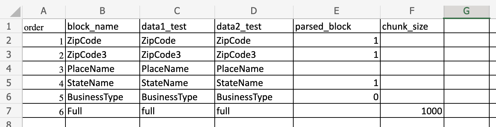
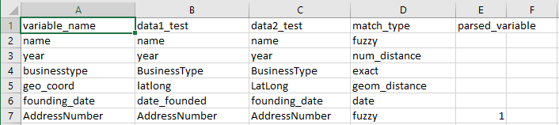

MAMBA2 User Guide

# Table of Contents

[Introduction](#Introduction)

[Getting started](#Getting-started)

[What Does MAMBA do?](#WhatDoesMAMBAdo)

[MAMBA Files](#MAMBAFiles)

[Setting Up](#settingup)

[Custom Matching Models](#custom_models)

[Recursive Feature Elimination](#recursive_feature_elimination)

[Manual Filter Selection](#manual_filter_selection)

[Available Testing Datasets](#available_testing_datasets)
# Introduction

MAMBA2 represents a substantial improvement in the flexibility and scalability of the original MAMBA, enabling the use on datasets beyond the Census' Business Register, using Natural Language Processing techniques to stem and clean textual data, and allow for comparisons of different match metrics in the same model. It also selects the best performing model from a list of Machine Learning algorithms.

## Getting started
 <a id="Getting-started"/>
 
System requirements:

Python 3.6 >

Getting MAMBA:

Download from our GitHub repo, [https://github.com/john-cuffe/MAMBA2](https://github.com/john-cuffe/MAMBA2)

### What Does MAMBA do?
 <a id="#WhatDoesMAMBAdo"/>

MAMBA is going to identify matching records from two (or a single datafile if running in deduplication mode). You can call them whatever you want, and save the names of the .csv files (without the .csv ending) in the mamba.properties file as data1_name and data2_name respectively. This file will then feed these names through all of the subsequent programs.

## Common Issues (in no particular order)

1. Make sure you have an /output directory in your projectPath
2. Ensure all of your datanames are correct in your mamba.properties file
3. If you have any json dictionaries for options in mamba.properties, make sure all keys and values are enclosed in double-quotes
4. If you are just debugging/testing, turn debugmode to True if you don't want to wait for hours
5. Make sure you have the correct setting for db_creation_mode
6. When using your matches, always always always make sure you have selected the correct batch id.

## MAMBA Files
 <a id="#MAMBAFiles"/>

### /projectPath/\*data1_name\*.csv

The name of the first dataset you want to match. Must contain a unique column 'id' to server as your unique identifier for that record. Whenever you see \*data1_name\* in this guide, substitute this for the name of the dataset in your code/.bash file. NOTE: IF YOU ALREADY HAVE A DATABASE, THEN \*data1_name\* is just the name of the first table you want to match in your db.

### /projectPath/\*data2_name\*.csv
 
The name of the second dataset you want to match. Must contain a unique column 'id' to server as your unique identifier for that record. Whenever you see \*data2_name\* in this guide, substitute this for the name of the dataset in your code/.bash file. NOTE: IF YOU ALREADY HAVE A DATABASE, THEN \*data2_name\* is just the name of the first table you want to match in your db.

### Block_names.csv

This file is going to tell MAMBA which variables in your dataset serve as 'blocks'. A block is a set of records (e.g. all records in a zip code, a state etc) where _all_ records within that block will be compared to each other, unless you specify global or variable filters (see below).

#### Variables:

 - order: which order (1 being the first) you want the blocks run in. If a record on a dataset receives a match in a block, it is not examined in any subsequent blocks.
 - block_name: A naming convention for the block.
 - \*data1_name\*: This column header(s) should be your data1_name in your run_match.bash file. This is the name of the variable that corresponds to the block in the first dataset you wish to match
 - \*data2_name\*: This column header(s) should be your data1_name in your run_match.bash file. This is the name of the variable that corresponds to the block in the second dataset you wish to match.
 - Parsed_block: See below. 1 if the block comes from a parsed variable, 0 otherwise.
 - chunk_size: If you expect very large blocks, or want to do an unblocked match but still want multiprocessing, enter a max block size here.  Leave blank otherwise.  See Note for details.
 - variable_filter_info: If you want to have a particular filter for the block, enter a json dictionary here (see below for details).
#### NOTES

- All block variables are assumed to be strings or text data types.  Blocking by floats or integers is not supported.
- If you want to do a full cross product with no blocking, include a row with 'full' as the entry for the block name and 'full_block'.  
- If you want to block on _multiple_ columns, separate each column header in  \*data1_name\* and \*data2_name\* by a semi-colon.  
  - If you do this, ALL COLUMN HEADERS ACROSS BOTH DATASETS MUST BE THE SAME. 
  - If you want to use multiple columns, then you must do so on BOTH sets of data.
- If you are using the parse_address function and want to include outputs from the parsed addresses as block (e.g. you want to use the city and zip code) you must use the exact names from the _address_component_matching.csv_ file or the [usaddress docs](https://usaddress.readthedocs.io/en/latest/) for the block name, \*data1_name\* and \*data2_name\* column.
- You can reduce the ZipCode variable to any number of digits by including the digit at the end of ZipCode. For example, to block by 3-digit zip code, include a block that has 'ZipCode3' as its name.
- The chunk_size parameter is only available on 'full' blocks. It will be ignored otherwise.

#### Figure 1. Demonstration of block_names.csv file.

### projectPath/mamba_variable_types.csv

This file tells MAMBA what kind of analysis to do on different kinds of variables you are using for matching. All of these models will be used to generate the matching models if you are using the built-in models.

#### Variables:

 - Variable_name: generic name for the comparison.
 - \*data1_name\*: This column header should be your data1_name in your run_match.bash file. This is the name of the variable that corresponds to the variable in the first dataset you wish to match
   - \*data2_name\*: This column header should be your data1_name in your run_match.bash file. This is the name of the variable that corresponds to the variable in the second dataset you wish to match.
   - match_type: What kind of match analysis do you want to perform?
       - fuzzy: generate 12 fuzzy string comparators for the candidate pair
       - num_distance: difference between the two values.
       - exact: If the two values are equal (incluing missing), scored as a 1, otherwise scored as a 0.
       - soundex: A Levenshtein distance comparison of soundex codes from the fuzzy library (see: https://pypi.org/project/Fuzzy/).
       - nysiis: A Levenshtein distance comparison of NYSIIS codes from the fuzzy library (see: https://pypi.org/project/Fuzzy/).
       - geo_distance: Distance between two points (in kilometers) based on Haversine formula. Using this type requires that each dataset has a latitude and longitude variable, and this column is completely filled for all observations.
       - date: This type of date variable will be compared using the Levenstein (edit) distance between the two strings of dates.  Ensure your dates are formatted in the same way before saving your datasets.
           - If either value is missing, returns 0. 
           - We just use the edit distance here because it provides an informative view of the number of edits and substitutions required to make the strings match. This is preferred over a strict subtraction of dates. For example, 1/1/2021 and 1/1/1011 is most likely a clerical error and requires only one substitution would match, but a simple distance calculation would give these two dates as a millennia apart.
           - If you wish to block or filter by particular portions of a date, then include it as a separate variable (so extract the year and put in a separate column).  Issues with how pandas and python read potential erroneous timestamps [Pandas Docs](http://pandas-docs.github.io/pandas-docs-travis/user_guide/timeseries.html#timeseries-timestamp-limits)
 - Parsed_variable
   - Is the variable an output from parsing an address? If so, 1, otherwise 0
   - custom_variable_name
          - With this column, you can enter the name of a custom scoring metric from _projectPath.custom_scoring_methods_.  See below for details. \
          - If not using a custom scoring metric for the variable in question, leave blank.
 - custom_variable_kwargs
   - If the variable in question is a custom variable, include any keyword arguments here in the form a key/value pair dictionary.
   - Make sure that all entries are enclosed in double quotes.  MAMBA will load in strings that look like numbers as numbers (so just negative/positive signs, decimal points, and integers will mean it's read as a number).
     - Example: {"foo":"bar","negative_Pi":"-3.14"}        
   - If not using a custom function, leave this blank. 
 - filter_only
   - If you only want to create this variable as a filter but not in the actual model, enter this as a JSON dictionary with the following information.
     - test: the test you want to use (see the filter info, it works the same way)
     - value: the value you want to evaluate (floats/integers are read as strings by JSON but converted under the hood.)

#### Figure 2. Demonstration of mamba_variable_types.csv

#### NOTE ON PARSED VARIABLES:

- Ensure that variable_name, \*data1_name\* and \*data2_name\* are all filled out with the exact address_component from _address_component_matching.csv_ or the [usaddress docs](https://usaddress.readthedocs.io/en/latest/)

#### NOTE ON CUSTOM SCORING METHODS:

 - There is a _DEMO_ file provided, but you need to create your own in your projectPath directory.  
 - You MUST enter a 'custom_scoring_methods.py' file in the *projectPATH* directory.  I do this because I was tired of commits over-writing my custom functions.
 - The function must accept as an argument a tuple of size two _and also must handle missing values_ (e.g. by giving a particular value to missings).  The main system will break if you leave missings in there.
 - \*data1_name\* and \*data2_name\* can be referred to as X[0] and X[1] in the tuple (since remember, kids, Python counts from 0).
 - You MUST have a named 'headers' argument in your string.  This is because when we are using fuzzy scores but not including all of the possible values for a score (e.g. just qgram and editdistance for a fuzzy) we need to know which models to run.
 - USING JSON:
   - If you want to use variables inside JSON dictionaries in your database, do the following:
     - keep the variable names the same as you normally would.
     - your main variable to do the comparison MUST have the following as keyword arguments
       - component_name_\*data1_name\* : the target component in your \*data1_name\* dataset.  Note this isn't the full path (you can code that into your function).
       - component_name_\*data2_name\* : the target component in your \*data2_name\* dataset.  Note this isn't the full path (you can code that into your function).
     - OPTIONAL keyword argument:
       - comparison_method: if you are using fuzzy matching variables defined in the main program, then have this read 'fuzzy', which will ensure the scores get organized appropriately. 

### projectPath/training_data_key.csv
This is the data that will tell MAMBA what you believe is a match and which is not if you are using the built-in supervised learning matching models. This file only contains three columns.
 - \*data1_name\*_id: the id for the record in the first dataset
 - \*data2_name\*_id: the id for the record in the second dataset
 - match: 1 if the pair is a match, 0 otherwise.

### projectPath/*data_1_name*_training.csv and projectPath/*data_2_name*_training.csv
These two files contain the right-hand side variables for the records in training_data_key.csv.

### projectPath/MAMBA.properties
 <a id="mamba_properties"/>
This is the file you will edit to run MAMBA.  After setting your configurations, just run run_match.py *your project folder name here*.

#### Variables:

 - projectPath:
      - Path to a folder you create (can be inside or outside the MAMBA directory) that contains all of your project's data and configuration files.
 - Data1_name
      - The name of the first dataset. Exclude the '.csv' ending.
 - data2_name
      - The name of the second dataset. Exclude the '.csv' ending.
 - db_flavor
      - The 'flavor' of sql database.  Current options: sqlite, postgres.
        - NOTE: if using postgres, ensure you have the correct db_host, db_port, db_user, and db_password in the mamba properties file
 - db_name
      - The name you want to give your database file. Exclude the '.db' ending
 - Debugmode
      - True/False that skips the majority of matches and develops a model on only one iteration, so the program runs quickly for efficient testing.
 - block_file_name:
      - the name of the file that you are using to define the blocks.
 - db_creation_mode:
      - If you want MAMBA to create your database, set this to 'create'.  Otherwise enter None
 - create_db_chunksize:
      - A variable to set how big of a 'chunk' you push to your db at once.
 - Training_data_name:
      - The name of the training data you are using. Exclude the '.csv' ending
 - Rf_jobs:
      - Number of jobs you want to calculate the random forest on. Note, for Python you want to have one job per CPU for reasons I don't entirely understand.
 - clerical_review_candidates:
      - If True, then python generates clerical review candidates for you to do further training data creation. These candidates will be a sample of all matches with a predicted probability greater than the clerical review threshold below.
 - clerical_review_threshold:
      - A dictionary that shows the variable and value you want clerical review candidates based on.  See below for details 
 - custom_selection_statement:
   - Sometimes we want to have a customized selection statement to narrow down what we want to match. Either leave as 'False' or provide a JSON dictionary for each dataset (called \*data1_name\* and \*data1_name\*).  WARNING: if you enter this, then the default behavior of matched observations not being considered for matches in later blocks will disappear.
     - example where both have different selection: {"my_data_1_name":"my_target_var > 5", "my_data_2_name":"my_target_var < 5"}
     - example where only one is used: {"my_data_1_name":"my_target_var is not NULL"}
 - match_threshold:
      - what is the threshold you want to consider a 'match'.
 - chatty_logger:
      - If True, logger returns an entry after every block matched.
 - Log_file_name:
      - Name of the .log file you want to use. Exclude '.log' from the name
 - numWorkers:
      - number of workers you want to run the matching on. As with rf_jobs, assume one job per CPU you are utilizing.
 - Prediction:
      - Do you want MAMBA to predict matches. If set to False, then you can generate clerical review candidates only (if clerical_review_candidates=True)
 - Scoringcriteria:
      - A scoring criteria selected from scikit-learn's list. See [https://scikit-learn.org/stable/modules/model_evaluation.html](https://scikit-learn.org/stable/modules/model_evaluation.html)
 - mode
   - can be deduplication, in which case we are targeting a single table (and target table needs to be filled) or normal
 - target_table
   - if in deduplication mode, what's the table we are targeting? This will be imputted into */data1_name*/ and */data2_name*/
 - Ignore_duplicate_ids:
      - If True, assumes that you are attempting to de-duplicate the same file, and thus does not compare records with matching ID variables. If False, then compares all records as normal.
 - Use_logit:
      - If True, run a logit and set scoringcriteria to accuracy. Logger will return a warning message about collinearity if it's bad. If False, doesn't run a logit.
 - date_format:
      - The format of the date columns in your .csv files. For example, '09-01-2020' would be '%m-%d-%Y'. See format codes here [https://docs.python.org/3/library/datetime.html](https://docs.python.org/3/library/datetime.html)
 - Parse_address:
      - See below for details
      - If parse_address is True, then the following three variables must be used.
 - Address_column_\*data1_name\*:
      - The name of the address column to parse in the \*data1_name\* csv file
 - Address_column_\*data2_name\*:
      - The name of the address column to parse in the \*data2_name\* csv file
 - Use_remaining_parsed_address:
      - Do you want to use any remaining address information beyond what is specified as a variable or a block.
 - Use_custom_model:
      - Do you have a custom matching model you want to run? See Custom Models for details
 - Imputation_method:
      - Either 'Nominal' or 'Imputer'.  See Imputation Methods below for details
 - saved_model:
      - If you have a model that you have saved and wish to use, enter its name here (include the .joblib ending).
 - saved_model_target:
      - If you want to _save_ your model, enter a file name here, ending with '.joblib'
 - feature_elimination_mode:
      - If this is set to True, the models generated will be fitted with recursive feature elimination.
 - global_filter_statement:
   - If this is anything other than 'False', this tells MAMBA to only select a specific subset of possible matches using the SQL statement provided.  See below for details.
 - use_mamba_models:
      - If True, use the mamba machine learning built-in models to find the best model.  If False, you must have a custom model in place, and this will be used to make predictions.
 - OPTIONAL:
   - used_fuzzy_metrics:
     - If you want to restrict the fuzzy match variables used in the model, enter a comma separated list of the names (get with [i.__name__ for i in febrl.methods]) of the fuzzy comparators you want to use.
   - debug_block:
     - A single block id you want to run (e.g. a single zip code) for testing.  If you are using multiple columns for your block, enter the JSON dictionary for the block. Note here -- this is assuming we just have one blocking pass.  For multiple blocking passes, use debug_block_list.
   - debug_block_list:
     - A comma separated list of blocks you want to run (if you want to run multiple blocks for testing).  If you are using multiple columns for the block, enter the JSON dictionary for each block. In cases of multiple blocking passes, requires a 'block_order' parameter, which tells Python which blocking pass each debug block refers to. 
   - model_only:
     - If True, then the process will terminate after a model has been produced. 
   - matched_pairs_table_name:
     - If you aren't using the generic matched pairs table name, put the name here.  If present, it will print a warning that you need to set that table up.
   - clerical_review_candidates_table_name:
     - Same logic as the matched pairs table name.  If present, it will print a warning that you need to set that table up, as well as quick check to see if the table exists.  if it doesn't, it will shut down.

### projectPath/block_model_mapping.csv

There may be instances where the 'model' used for matching varies between blocks--for example, address matching for addresses in Puerto Rico requires different information and a different structure than rural areas in the continental United States.  To account for this possibility, MAMBA allows the user to specify different models for different blocks.  The demo_business_data folder has example files.  Here is how to get started.

 - Specify any models you want to use and save them in the projectPath folder.  Make sure they have the standard MOJO formatting (.joblib ending and a .joblib.txt file with the json information on the model).
 - Create the block_model_mapping.csv file.
 - Specify any blocks and the model you want them to use that is not EITHER the mamba.properties::saved_model or the model that MAMBA will generate by itself if you haven't saved one already.  In effect, the saved or generated model will serve as the 'default' model.
 - Run MAMBA as normal. The logger will inform you which blocks are using any model that isn't the basic mamba.properties saved_model version.

Some Notes:
 - Obviously, you'll need to set up and fit each model you want to use.  
 - As stated above, you can run either a saved model OR have MAMBA generate one on the fly for the run as normal.
 - You don't need individual training data for each 'block', unless that block alone requires its own separate model.

## Setting up:
 <a id="#settingup"/>
 
 - Create your project folder.  Inside it, you should have your two data files, three training data files (if you have them already), and your mamba.properties file.
 - Edit your MAMBA properties so each variable is configured correctly, save it with a name you want.
 - Configure variable_names.csv and block_names.csv are configured correctly.
 - IF YOU HAVE MADE ANY CUSTOMIZATIONS to create_db_helpers.py, match_helpers.py, soundex.py, or febrl_methods.py in the programs directory...
     - In a terminal, CD into the /programs directory
     - run the command _python setup.py build_ext --inplace_
       - This will cythonize the helper functions. 
 - CD into the main MAMBA directory
 - export your projectPath 
   - example: export projectPath=/home/users/foo/
 - Then given an encryption path if you're using encryption (this is where your .bin and .pw keys live)
     - example: export encryptionPath=/home/users/foo/conf
 - Run run_match
   - example: "python run_match.py"
 _ Watch MAMBA go!

## Clerical Review Candidates
- If you have clerical_review_candidates set to True, you have a couple of options to provide a JSON dictionary for MAMBA to give you back only records that meet the criteria you specify.
1.  If you are only looking at a single column:
   - In cases where you do not have a model, or don't want to use one, pick a variable you are relatively sure will give you decent starting points for matches, and a value below which you won't consider a match.  If you are using a fuzzy variable, the variable_name _must_ be in the format {variable name}_{fuzzy comparator}.
     - {"variable_name":"Address_Jaro", "value":".3"}
   - If you have a model, or would like to use it as the basis for your clerical review, then you can use the models predicted probability like so:
     - {"variable_name":"predicted_probability", "value":".3"}
2.  If you want to look at multiple columns:
   - Have a component called "listed_variable_names", which is a list where each component looks like the entry above.  
   - Have a component called "query_logic" that is either "and" or "or".
     - DEMO: {"listed_variable_names":[{"variable":"name_qgram3", "value":".65"},{"variable":"street_name", "value":".85"}], "query_logic":"and"}
- Option 1) here could easily fit into option 2) but I don't want to break any useable mamba.properties files.
## Parsing Addresses
 <a id="#parsingaddresses"/>

Much pre-processing for record linkage programs focuses on how best to parse addresses into useful strings. Although MAMBA makes minimal assumptions about data structure, it does offer the ability to use unparsed addresses to create variables to feed into the record linkage model, as well as blocks to structure the record linkage. This feature uses Python's _usaddress_ module to identify component blocks of an address. Imagine you have a column that contains an unparsed address (e.g 123 Main Street, Apartment 1, Anytown, AS, USA), the _usaddress_ library is able to identify the street number (123), the street name (Main), the street name type (Street), the occupancy type (Apartment) and the occupancy type number (1), as well as the city, state, and zip code. This presents a massive amount of data for MAMBA to use to match.
As described above, to use this feature, ensure _parse_address_ is set to True in your .properties file, and enter in the corresponding address columns for both of your datasets.
- In your mamba_variable_types file, enter any variables you want and the type of match, using the _exact_ naming convention used in the _address_component_mapping.csv_ file (also available on the usaddress website) for both the variable_name and the columns with the corresponding name for your datasets (Columns B and C). Indicate any parsed variables with a 1 in the parsed_variable column.
- In your _block_names.csv_ file, indicate any parsed blocks and their order you want to use using the _exact_ naming convention used in the _address_component_mapping.csv_ file (also available on the usaddress website) for both the block_name and the columns with the corresponding name for your datasets (Columns C and D). Indicate any parsed variables with a 1 in the parsed_block column.

### Using the use_remaining_parsed_address feature

  - While parsing addresses, users may not want to compare multiple strings, but rather only identify some components of a parsed address to use as blocks or strings. This function allows any remainder to be used as a fuzzy variable.
  - For example, imagine parsing the address '123 Main Street SW Apartment 1, Anytown, AS, 12345'. If we wanted to match using city, state, and zip as blocks and include the address number as a variable, MAMBA would remove those features from the string but leave 'Main Street SW Apartment' as a string, which itself may contain valuable information. Leaving the _use_remaining_parsed_address_ feature as 'True' tells MAMBA to create a new fuzzy variable to use in the model based on _all_ of the address components _not otherwise used as a block or a separate variable_.
 
## Custom Matching Models
 <a id="custom_models"/>
 
  - Users may wish to user their own custom matching model in addition to those available in MAMBA.  
  - If so, user must enter a fully self-contained function in *projectPAHT*/_custom_matching_function.py_ to run, as well as set the custom_matching function in your mamba properties file to True.
  - The model must be a python _class_ with a single requirement of a predict_proba function, which can return anything.
  - Must return a model-like object that has the same features (predicts, predict_proba, scoring etc.) as a standard scikit-learn model.
  - Turn _use_mamba_models_ to 'False' to only use the custom model and none of the MAMBA built-in models.
  - Note that this file must be in your PROJECT directory, not the main MAMBA directories.
  - If you want to return a JSON object from your model, the JSON MUST have a 'predicted_probability' element.

## Imputation Methods
 <a id="imputation_methods"/>

Imputation of missing data is a major element of record linkage problems.  MAMBA takes a more hands-off (i.e. the user has to do it) approach to this problem, but offers users two options to fill in misisng values, set in the imputation_method variable in your mamba_properties.
  - Imputer:
      - With this option, any missing values for 'fuzzy' or 'numeric distance' variables are replaced iterative imputer.  See the [scikit-learn documentation](https://scikit-learn.org/stable/modules/generated/sklearn.impute.IterativeImputer.html) for further details.
        - While this option is easy to implement, it may result in non-sensical outcomes or potentially be subject to existing missing biases in the data.
    - Nominal:
      - This option follows a more traditional approach of converting the continuous fuzzy and numeric variables to nominal variables, and then assigning cases with missing data a particular value.
        - In the case of 'fuzzy' variables, the nominal variable created is divided evenly between every .1 value (so 0, .1, .2...1.0).  In a case where _either_ value is missing, the score is -1.
        - In the case of numeric variables, any case with missing data is filled with ten times the maximum possible value for the comparison across the entire dataset.  I should probabaly research if this was a good idea.
    
  - Additional Imputation Notes:
    - Distance variables are imputed with a value, in kilometers, of 4 times the diameter of the earth.  Future iterations will impute based on any possible geographic information, e.g. taking mean difference between all cases in a certain zip code.
    - Exact matching variables are coded as 0 (non-match), 1 (match), and -1 (either case is missing).
   
 
 ## Recursive Feature Elimination
  <a id="recursive_feature_elimination"/>
 One of the biggest drawbacks to MAMBA's use of multiple string comparators is, unsurprisingly, that MAMBA is then forced to generate scores for each of the 13 string comparators for any fuzzy variables the user wishes.  While the overall fit of the models improves with more string comparators (Cuffe and Goldschlag, 2016), no amount of clever computing can overcome the need to do this many calculations.  
 To give the user an opportunity to avoid this issue, this mode selects the lowest number of features to maximize the score for the model, while still using a randomized, paramterized grid search.  This mode can save substantial time:  For example, for a single 'fuzzy' variable, it can take MAMBA approximately 1.28 seconds (over 4 seconds without Cython) to create 1000 scores.  However, the individual string comparators themselves are created in a mean time of .098 seconds, with a median of approximately .03 seconds.  In large runs, the extra time required to generate models that filter out features that don't contribute to the overall performance of the model will save substantial time. For example, the Smith-Waterman distance function takes .69 of a second to complete 1000 comparisons, over 375 times slower than the fastest algorithm (the Jaro-Winkler comparator)

## Manual Filter Selection
<a id="manual_filter_selection"/>

- In general, the MAMBA philosophy for matching is to let the model do all of the work, which should result in less human-generated bias in any matches.  However, MAMBA does offer three features where the user can introduce a filter for matches, one before matches are selected, and another where no candidate pair with a score below a certain threshold can possibly be a match. This section discusses each in turn. 
### global_filter_statement:
- This feature tells MAMBA to filter model matches for candidate pairs below a certain threshold.
- If this feature is used, MAMBA takes the following steps:
  1) Generate a score, for each match candidate pair, on the variable chosen
  2) Retain only those match candidate pairs that have a score exceeding the chosen threshold
  3) Generate full scores/model predictions for remaining pairs.  - You will need to use 'a' in place of *data1.name* and b in place of *data2_name*.
- Leave this as 'False' otherwise.
- Example:
  - a.create_date = current_date --this selects only *data1_name* created on the current_date
  - b.id > 2000 --this selects *data2_name* rows where the ID is above 2000
  - (a.id < 2000 and b.id >= 2000) | (a.id >=2000 and b.id <2000 ) | (a.id >=2000 and b.id >= 2000) -- this would be used if you wanted to just test 'new' data in each dataset against the existing data where ids are both 2000+ in the new data pull, avoiding re-matching already matched observations.

### block filtering:

- This feature is designed to allow users to dictate, for each block, a subset of possible candidates within a block to pursue.  This is akin to the 'super blocking' or attempts to alter block sizes, which can lead to faster linkage performance when you have a large number of blocks but each block has relatively few candidate pairs.
- To implement, _for each block you want to have a variable filter for_, enter a json dictionary with the following keys, with all values enclosed in double quotes:
  - Keys:
      - variable_name: name of the variable as it appears in mamba_variable_types.csv
      - *data1_name*: the name of the filter on the data1 dataset
      - *data2_name*: the name of the filter on the data2 dataset
      - match_type: the type of match (same as the usual variable list)
        - NOTE: If you utilize an 'exact' match, the filtering will be done on the DB, which will save the most time.  Otherwise it will be done by python
      - fuzzy_name: IF the variable is a fuzzy variable, which particular character do you want to use 
        - Options:'jaro', 'winkler', 'bagdist', 'seqmatch', 'qgram2', 'qgram3', 'posqgram3', 'editdist', 'lcs2', 'lcs3', 'charhistogram', 'swdist', 'sortwinkler'
      - test: the test you want to apply.
        - Options: ==, !=, >, >=, <, <=, custom
        - if this is custom, must be using the optional statement below.
        - NOTE that the 'left' value of this comparison will always be *data1_name*.  If you can't make that work, then use a custom function.
      - filter_value: the value you want to compare. Not needed for exact matches as they just compare *data1_name* and *data2_name*.
      - OPTIONAL:
        - custom_test: Provide your own custom statement to run.  Here, *data1_name* and *data2_name* can be any combination of variables or data from the two tables, with different variables separated by commas. Refer to *data1_name* as 'a' and *data2_name* as 'b.'
        - example:
        {"*data1_name*": "zip5,left(first_name) as first_name",
          "*data2_name*": "zip5,first_name","match_type": "custom",
          "test": "custom",
          "custom_test": "a.first_name=b.first_name and a.zip5=b.zip5"}
- Demos:
  - fuzzy {'variable_name': name, 'fuzzy_name': 'jaro', 'test':'>', 'filter_value':.75, "match_type":"fuzzy"}
  - custom {'variable_name': first_char, 'fuzzy_name': '', 'test':'=', 'filter_value':1, "match_type":"custom"}
  - date {'variable_name': year, 'fuzzy_name':'', 'test':'>=', 'filter_value':.5, "match_type":"date"}
  - exact: {"variable_name":"name","test":"==","{data1_name}":"name_of_data1_variable_name","{data2_name}":"name_of_data2_variable_name","match_type":"exact"}
  - custom: {'{data1_name}':"some_string_variable", '{data2_name}':"some_array_variable", 'match_type':'custom', 'test':'&&', match_type="custom_statement"}

- Notes:
  - For date variables, filter_value is given as the score on the Editdist command, which is limited between 0 and 1.
  - The logs and stats for the run will show how many observations were cut by the filter.

### Variable Filters
- This feature is designed to allow users to have variable-level filters that are not a part of the predicted model used as filters.  For example, you may wish to restrict comparing businesses to those in the same NAICS sector.  In order to use this feature, do the following:
  - Create a new row in the mamba_variable_types.csv file. Fill it in exactly the way you would normally.
  - For the 'filter only' entry, add in 
    - test - the same test logic used in the other filter section
    - value - the same value logic used in the other filter section above.
- Notes:
  - These filters will be run _after_ any block-level filters.  So for example if you want to compare only 5-digit zip codes within a 3-digit zip code block _and_ filter that a name score has to be greater than .5, the zip code restrictions will be done first.
  - If you have _multiple_ of these variables, they will be processed in the order you put them in the folder. The data will be reduced to the set of records that meet _all_ of the criteria you put in.
  - If you want some kind of "or" statement, you can make a custom variable.

## Available Testing Data
 <a id="available_testing_data"/>

There are two 'toy' datasets available for you to test MAMBA.

- R10000
  - This dataset is the RLdata10000 dataset available in the R Record Linkage library (https://cran.r-project.org/web/packages/RecordLinkage/RecordLinkage.pdf).  It holds just the first name, last name, and dob for individuals, a 'block' variable of the first letter of the last name, as well as en entity id (ent_id) and a row id.
- demo_business_data
  - This dataset is a randomly generated set of businesses with name, addresses, founding year, lat/long coordinates, and business type.  This should enable the user to test a wide variety of match situations quickly.
- 